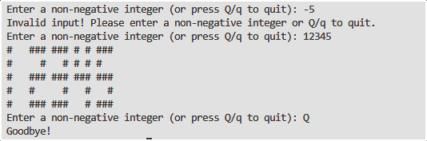

# Seven-Segment LED Display Simulation

This Python program simulates the work of a seven-segment LED display using ASCII art. The program converts any non-negative integer input by the user into a visual representation of digits, each built from 13 "LEDs". The user can also quit the program by pressing `Q` or `q`.

## Features

- Displays any non-negative integer using an ASCII-based seven-segment-like pattern.
- Allows continuous input until the user either enters a valid number or chooses to quit.
- Gracefully handles invalid inputs by asking the user to try again or quit.
- Case-insensitive quit option (`Q` or `q`).

## Example

Here's how the program displays the number `12345`:

